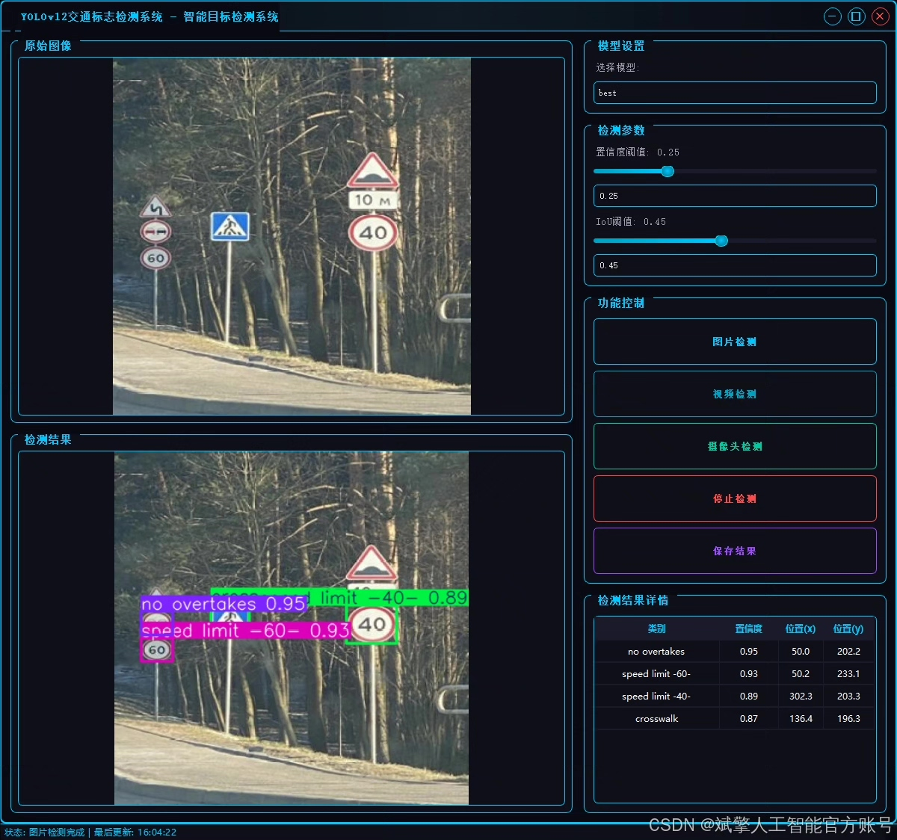
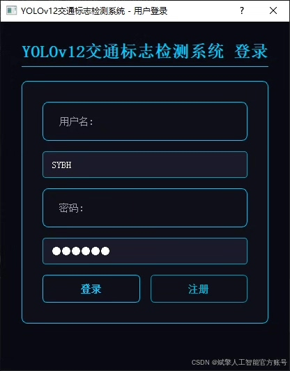
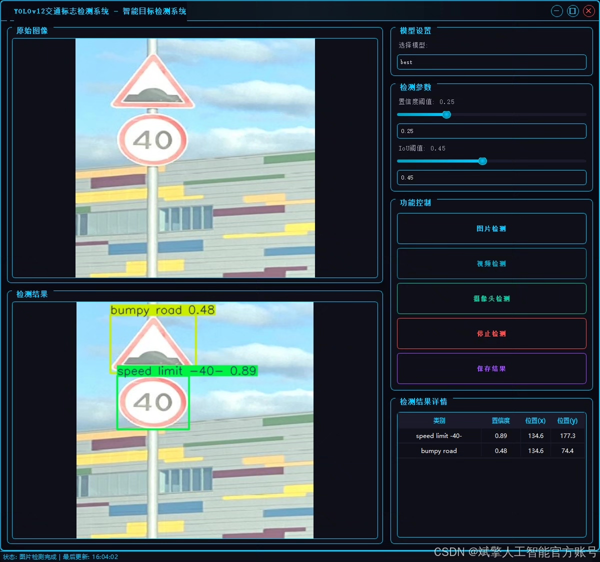
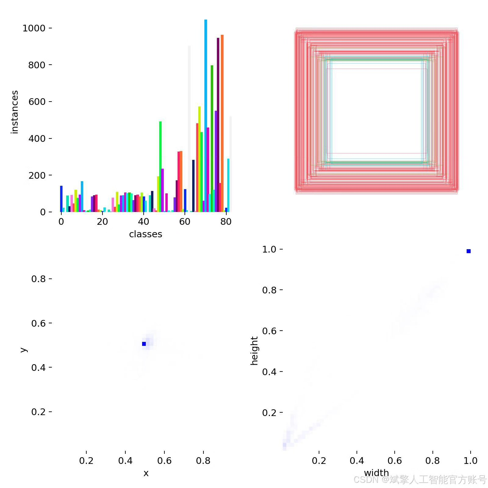
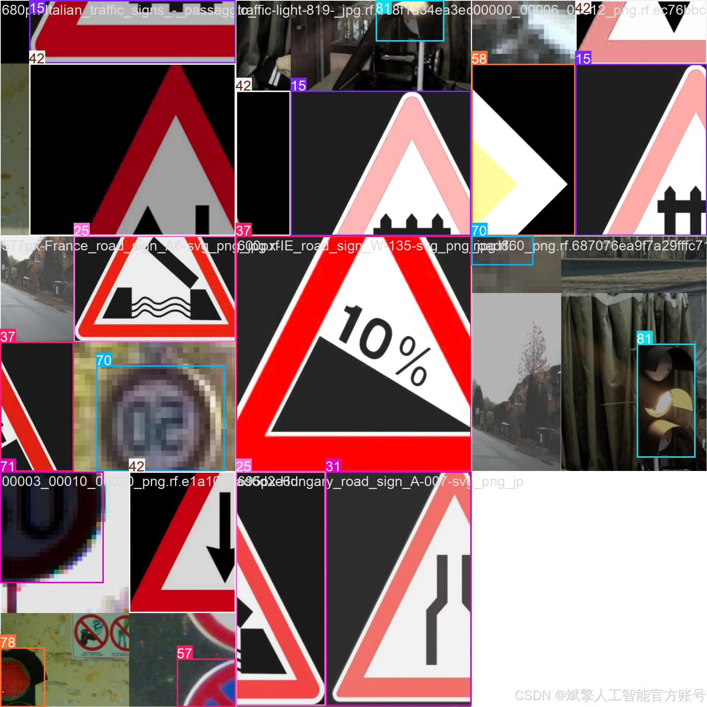
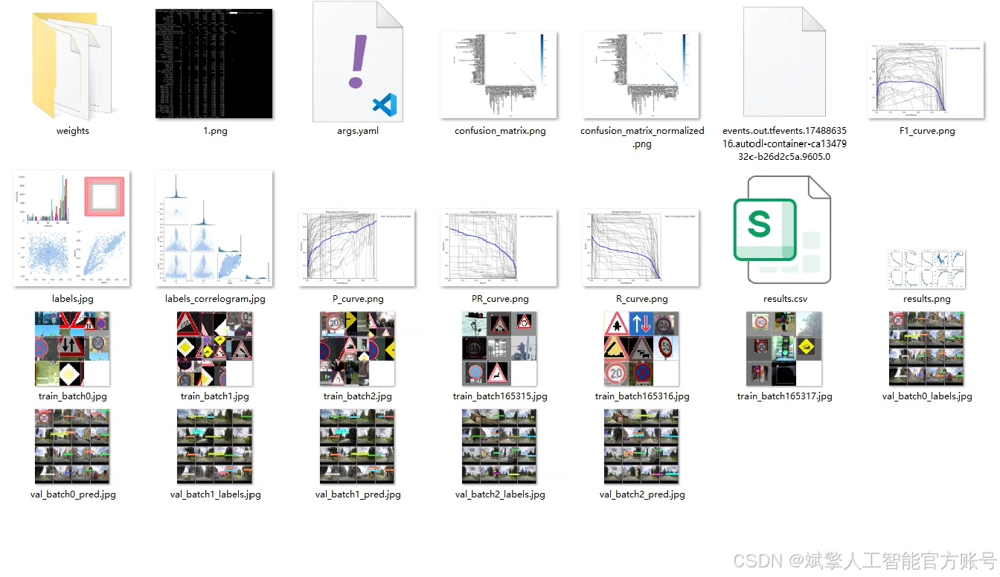
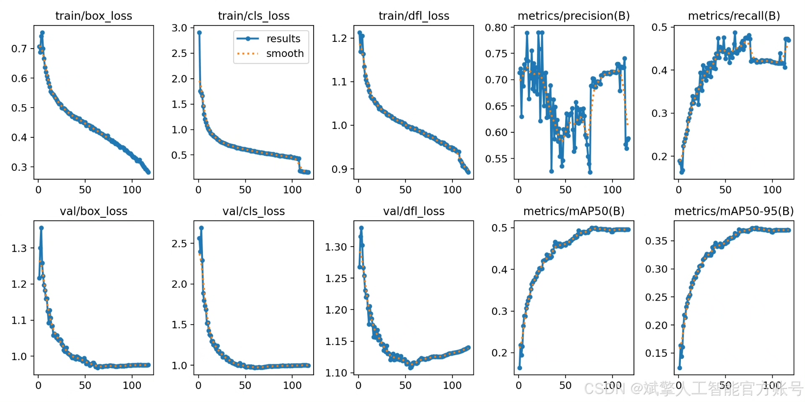
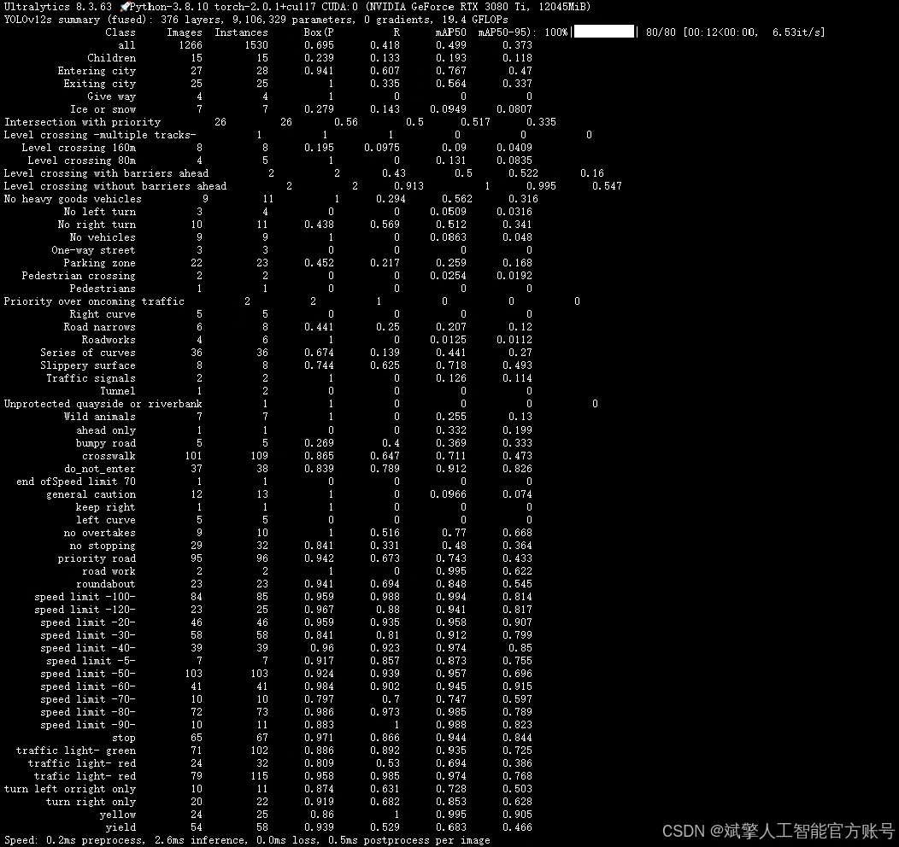

# Based on deep learning YOLOv12 for traffic sign recognition detection system (YOLOv

## Body

This project has developed a traffic sign recognition and detection system based on the deep learning YOLOv12 model, which can accurately recognize 83 common traffic signs, including prohibition signs (such as "No Entry" and "No Parking"), warning signs (such as "Falling Rocks" and "Pedestrian Crossing"), indication signs (such as "Ahead Only" and "Roundabout"), and various speed limit signs (such as "Speed Limit 30" and "Speed Limit 120"). The system is implemented using the PyTorch framework, and it uses a high-quality dataset containing 12,356 training images, 1,266 validation images, and 654 test images for model training and evaluation. The data is strictly labeled and enhanced to ensure the robustness of the model in complex scenarios.

The project innovatively integrates a user-friendly graphical interface (UI), supporting login registration, image/video upload, and real-time detection functions, with results visualization for easy application. The system features high accuracy and efficiency, and can be widely applied in intelligent traffic management, autonomous driving assistance, road safety monitoring, and other fields, providing reliable technical support for smart city construction. The code structure is clear and modular design facilitates functional expansion and performance optimization, with significant practical value and scientific research significance.

✅ User login registration: Supports password verification and security validation.
✅ Three detection modes: Based on the YOLOv12 model, supports image, video, and real-time camera detection, accurately recognizing targets.
✅ Dual-screen comparison: Displays the original scene and detection results simultaneously on the screen.
✅ Data visualization: Real-time table displaying the category, confidence, and coordinates of detected targets.
✅ Intelligent parameter adjustment: Provides a confidence slide bar to dynamically optimize detection accuracy, adapting to different scene requirements.
✅ Sci-fi style interactive interface: Dark theme combined with dynamic light effects, reducing visual fatigue and improving operational experience.

## Images

## Payment

Here is a pay link on Stripe ( https://buy.stripe.com/3cs8yP7sY87d0vu9AB ). Please contact me lonlonago@foxmail.com after funding $89, and I will send you a complete data files , thank you!

